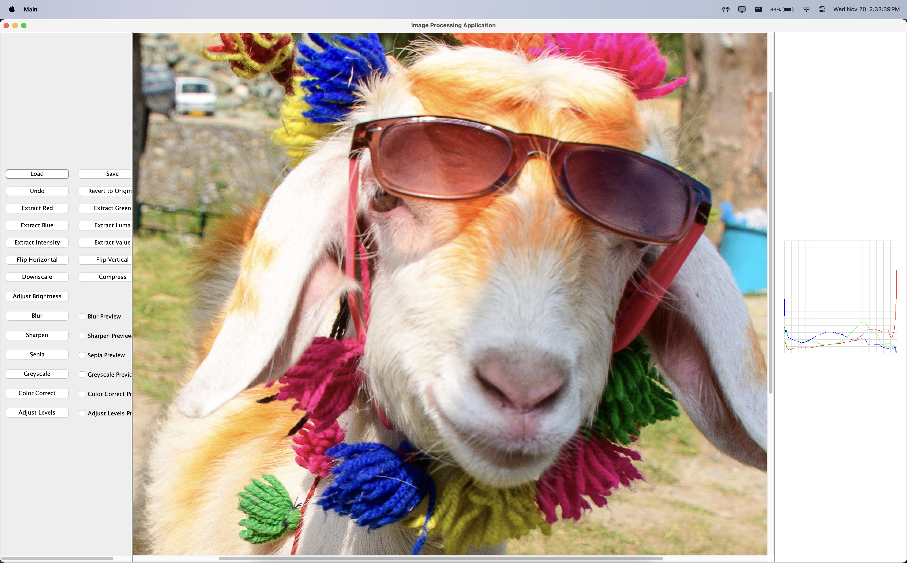
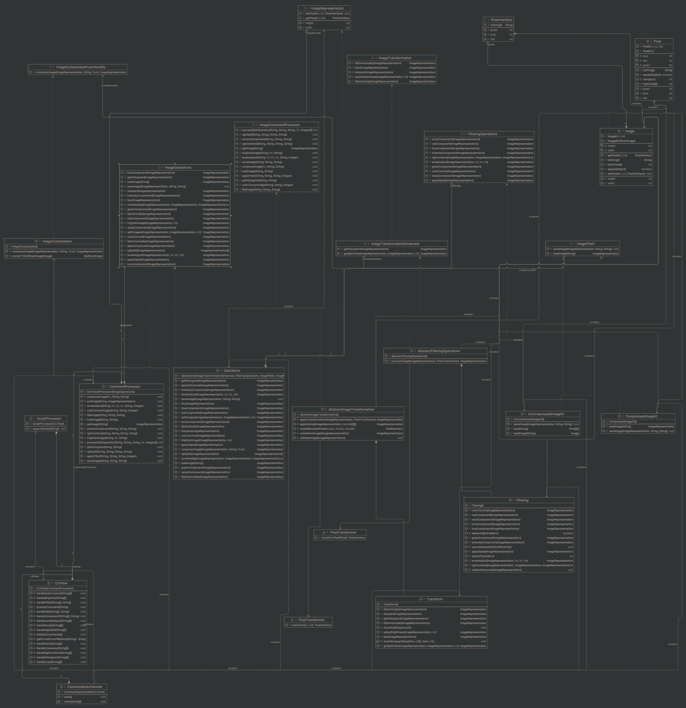

# Imageinator: Command-Line Image Processing Tool

*Imageinator* is a command-line image processing tool that allows users to load, manipulate, and
save images. It supports various operations such as splitting and combining RGB channels, applying
blur and sepia effects, brightening images, and more.

## Table of Contents

* [Features](#features)
* [Requirements](#requirements)
* [Installation](#installation)
* [The Graphical User Interface](#the-graphical-user-interface)
* [Command Reference](#command-reference)
* [How to Run a Script](#how-to-run-a-script)
* [Example Workflow](#example-workflow)
* [Project Structure](#project-structure)
* [How to use the project - USEME](#How-to-use-the-project)
* [Testing Resources](#testing-resources)
* [Changelog](#change-log)
* [Contributors](#contributors)
* [Image Credits](#image-credits)

## Features

**Core Features:**

- Load images from different file formats (PNG, JPG, etc.)
- Split and combine RGB channels
- Apply various effects (blur, sepia, brightness)
- Save processed images in desired formats
- Command-line interface for interaction
- Script support for batch processing

**Image Effects:**

- Blur and split-view blur
- Sepia tone
- Brightness adjustment
- Image sharpening
- RGB channel manipulation
- Vertical and horizontal flips
- Image compression
- Histogram generation
- Auto color correction

## Requirements

- **Java 11+**: This project requires JDK 11 or higher
- **Libraries**: Standard Java libraries for file handling and I/O operations

## Installation

1. Clone the repository:

```bash
git clone <repository-url>
cd <project-directory>
```

2. Compile the project:

```bash
javac -d bin src/com/vanarp/viewer/*.java src/com/vanarp/model/*.java src/com/vanarp/controller/*.java
```

3. Run the application:

```bash
java com.vanarp.controller.CLIView
```

## The Graphical User Interface



To know more about how to use the GUI refer to [GUI User Manuel](GUI.md)

## Command Reference

### Load and Save Operations

Load an image into the application:

```
load <image-path> <image-name>
```

Example:

```
load images/koala.jpg koala
```

Save a processed image:

```
save <image-path> <image-name>
```

Example:

```
save images/koala-processed.jpg koala-processed
```

### RGB Operations

Split an image into RGB channels:

```
rgb-split <image-name> <red-image-name> <green-image-name> <blue-image-name>
```

Example:

```
rgb-split koala koala-red koala-green koala-blue
```

Combine RGB channels into a single image:

```
rgb-combine <red-image> <green-image> <blue-image> <combined-image>
```

Example:

```
rgb-combine koala-red koala-green koala-blue koala-combined
```

Extract red component:

```
red-component <image-name> <dest-image-name>
```

Example:

```
red-component koala koala-red
```

Extract green component:

```
green-component <image-name> <dest-image-name>
```

Example:

```
green-component koala koala-green
```

Extract blue component:

```
blue-component <image-name> <dest-image-name>
```

Example:

```
blue-component koala koala-blue
```

### Image Transformations

Flip image vertically:

```
vertical-flip <image-name> <dest-image-name>
```

Example:

```
vertical-flip koala koala-vert
```

Flip image horizontally:

```
horizontal-flip <image-name> <dest-image-name>
```

Example:

```
horizontal-flip koala koala-horiz
```

Adjust brightness:

```
brighten <image-name> <dest-image-name> <increment>
```

Example:

```
brighten koala koala-bright 10
```

### Effects and Filters

Apply blur effect:

```
blur <image-name> <dest-image-name>
```

Example:

```
blur koala koala-blurred
```

Apply split-view blur effect:

```
blur <image-name> <dest-image-name> split <percentage>
```

Example:

```
blur koala koala-split-blur split 50
```

Apply sepia tone:

```
sepia <image-name> <dest-image-name>
```

Example:

```
sepia koala koala-sepia
```

Sharpen image:

```
sharpen <image-name> <dest-image-name>
```

Example:

```
sharpen koala koala-sharp
```

### Advanced Operations

Compress image:

```
compress <percentage> <image-name> <dest-image-name>
```

Example:

```
compress 50 koala koala-compressed
```

Generate histogram:

```
histogram <image-name> <dest-image-name>
```

Example:

```
histogram koala koala-histogram
```

Auto color correction:

```
color-correct <image-name> <dest-image-name>
```

Example:

```
color-correct koala koala-corrected
```

### System Commands

Execute a script file:

```
script <script-path>
```

Example:

```
script commands.txt
```

Exit the application:

```
exit
```

## How to Run a Script

### Creating and Running Scripts

1. Create a script file (e.g., `commands.txt`) containing a series of commands:

```
load images/koala.jpg koala
brighten koala koala-bright 10
blur koala-bright blurred
save images/output.jpg blurred
```

2. Execute the script:

```
script commands.txt
```

### Script Guidelines

- Write one command per line
- Use the same command format as interactive mode
- Invalid commands will show errors but won't stop execution
- All commands available in interactive mode can be used in scripts

## Example Workflow

Here's a typical workflow example:

```bash
# Load an image
load images/koala.jpg koala

# Split RGB channels
rgb-split koala koala-red koala-green koala-blue

# Modify red channel
brighten koala-red koala-red-bright 10

# Combine channels
rgb-combine koala-red-bright koala-green koala-blue koala-modified

# Apply effects
blur koala-modified koala-final
compress 80 koala-final koala-final-compressed

# Save result
save images/koala-final.jpg koala-final-compressed
```

## Project Structure

The project is organized into three main packages:

### Controller Package

- `CLIView`: Main entry point and command-line interface
- `CommandProcessor`: Implements command pattern for operations
- `CompressedImageIO`: Handles PNG and JPG file formats
- `UncompressedImageIO`: Handles PPM file format
- `ScriptProcessor`: Manages script execution

### Model Package

- `Image` and `Pixel`: Core data structures
- `Operations`: Image processing algorithms
- `Filtering`: Effect implementations
- `ImageTransformation`: Transformation logic
- `ImageCache`: Performance optimization

### Viewer Package

- `CommandInputHandler`: Parses user commands
- `ScriptProcessor`: Processes script files

For a more detailed explaination on the project structure refer
to [Project Structure](PROJECT_STRUCTURE.md)

## Change log

### 1. Image Compression

- **Command**: `compress percentage image-name dest-image-name`
- **Description**: Compresses the specified image by a given percentage (between 0 and 100) to
  create an efficiently stored version. The higher the percentage, the greater the compression
  applied.

### 2. Histogram Generation

- **Command**: `histogram image-name dest-image-name`
- **Description**: Creates a 256x256 image representing the histogram of the specified image. The
  output includes line graphs for the red, green, and blue channels, making it easy to visualize the
  color distribution.

### 3. Color Correction

- **Command**: `color-correct image-name dest-image-name`
- **Description**: Corrects color balance in the image by aligning the meaningful peaks in its
  histogram. This adjustment improves the overall tone and balance of the image colors.

### 4. Levels Adjustment

- **Command**: `levels-adjust b m w image-name dest-image-name`
    - **Parameters**:
        - `b`: Black level (0-255)
        - `m`: Midtone level (0-255)
        - `w`: White level (0-255)
    - **Requirement**: Values must be in ascending order (b < m < w).

- **Description**: Adjusts the black, midtone, and white levels of the image based on the provided
  values, refining contrast and brightness.

### 5. Split View for Operations

- **Supported Operations**: Blur, sharpen, sepia, grayscale, color correction, levels adjustment.
- **Command Format**: `operation image-name dest-image split p`
    - `p`: Percentage of the width for the split line placement (e.g., 50 places the line halfway).

- **Description**: Generates a split-view version of the image with the specified operation applied
  to one part, while keeping the remaining part unaltered. This allows for side-by-side comparison
  of the effect.

### 6. GUI
- A GUI was designed to allow for greater ease of access and use. The GUI allows you to preview
and perform operations on images before saving them.

- the classes `GUIView` and `GUIController` we made.

### 7. Image Masking for Partial Image Manipulation.
- Image filtering operations (blur, sharpen, greyscale, sepia, component visualizations) now support
image masking operations which allow you to perform operations on a specific part of the image.


### 1. `ImageCompressor` Class

- **Purpose**:
    - The `ImageCompressor` class is dedicated solely to image compression operations. Given that
      compression is a distinct functionality without close parallels to other image
      transformations, it was designed as an independent class.
    - This approach enhances modularity and keeps the compression logic separate from other image
      manipulation tasks.

- **Implementation**:
    - The `ImageCompressor` class implements the `ImageCompressionFunctionality` interface, which
      defines methods specifically for compression.
    - This interface allows for flexibility in the way compression algorithms might be applied,
      enabling easy updates or additional compression methods in the future without impacting other
      parts of the code.

### 2. `ImageTransformationEnhanced` Interface

- **Purpose**:
    - The new functionalities (histogram generation, color correction, levels adjustment, and
      split-view operations) are grouped together under a single interface for image transformation,
      named `ImageTransformationEnhanced`.
    - This interface extends the existing `ImageTransformation` interface, meaning it inherits
      standard transformation methods while adding advanced transformation capabilities.

- **Structure**:
    - `ImageTransformationEnhanced` builds on `ImageTransformation` by adding methods specifically
      for:
        - **Histogram Generation**: Creating a 256x256 visual histogram for RGB channels.
        - **Color Correction**: Adjusting colors by aligning histogram peaks.
        - **Levels Adjustment**: Allowing customization of black, midtone, and white levels.
        - **Split View**: Applying transformations partially across the image with a defined
          vertical split.

### 3. Separation of Concerns

- **Modularity**:
    - By creating `ImageCompressor` as a separate class, the project maintains a clear separation of
      concerns. Compression is treated as a distinct operation that can evolve independently of
      transformation-based functionalities.
    - Grouping advanced transformation methods under `ImageTransformationEnhanced` keeps the code
      clean and organized, allowing each transformation to be easily managed and extended.

- **Extensibility**:
    - The choice to use interfaces (`ImageCompressionFunctionality` and
      `ImageTransformationEnhanced`) allows for future expansion. If new types of transformations or
      compression methods are introduced, they can be integrated without major code restructuring.

### 4. Interface and Class Design

- **ImageCompressionFunctionality**:
    - This interface defines the contract for image compression functions, ensuring that all
      implementations provide consistent compression operations. `ImageCompressor` currently
      implements this functionality but could be extended or replaced as needed.

- **ImageTransformationEnhanced**:
    - Extending `ImageTransformation` ensures backward compatibility, allowing
      `ImageTransformationEnhanced` implementations to use standard transformations alongside
      enhanced functionalities.
    - This interface includes methods for advanced transformations such as histogram generation,
      color correction, and split-view operations, ensuring these functions are consistently
      accessible and implemented across compatible classes.

## Testing Resources

- **Running Jar File:** Navigate to the folder of jar file in the terminal and type `java -jar ImageManipulationJava4.jar`.
- **Main Script for testing:** The script is located in `res\Scripts\script.txt` and is run using the
  command `script Scripts\script.txt`
- **Scripts for testing:** The scripts are located in `res\Scripts\script.txt`.
- **Example Source Images:** The example source image and the outputs are present in `res\Images`.
- **Testing resources:** All resources required for testing are located in the `\test` folder.

## How to use the project

For more information on how to use the project please refer to the [USEME](USEME.md)

## Class Structure

Refer to the image below for the class structure class diagram


## Contributors

- [Pranav Viswanathan](https://github.com/PranavViswanathan)
- [Saran Jagadeesan Uma](https://github.com/Saran-Jagadeesan-Uma)

## Image Credits

Sample images
by [Pranav Viswanathan](https://www.flickr.com/photos/199542081@N07/albums/with/72177720312735513)
